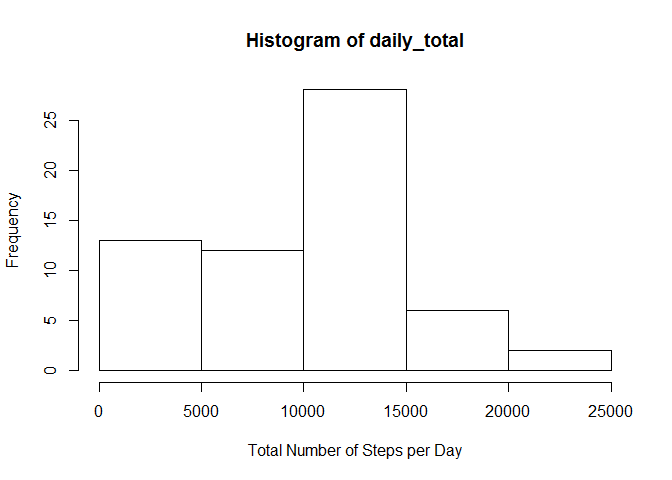
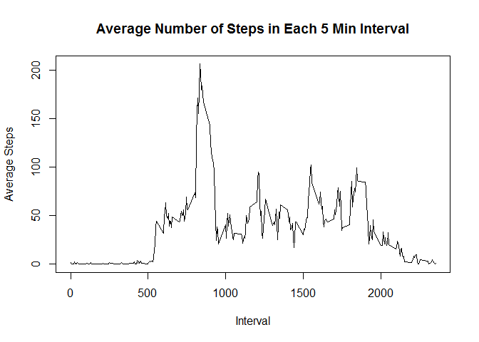
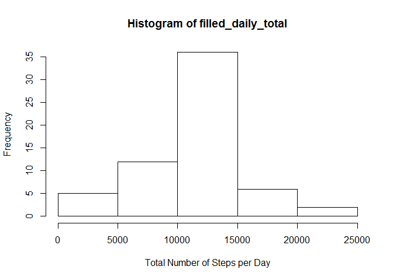

# Reproducible Research: Peer Assessment 1


## Loading and preprocessing the data

The data is loaded and preprocessed using the following code:

```r
data <- read.csv('activity.csv')

data$date <- strptime(data$date, format = '%Y-%m-%d', tz = 'GMT')
```


## What is mean total number of steps taken per day?

Histogram of Daily Total:

```r
daily_total <- sapply(split(data$steps, as.character(data$date)), sum, na.rm = TRUE)

hist(daily_total, xlab = 'Total Number of Steps per Day')
```

<!-- -->

**Mean of Daily Total:**

```r
mean(daily_total)
```

```
## [1] 9354.23
```

**Median of Daily Total:**

```r
median(daily_total)
```

```
## [1] 10395
```

## What is the average daily activity pattern?

A time series plot of the average number of steps in each 5 min interval is generated using the following code:

```r
interval_avg_steps <- sapply(split(data$steps, data$interval), mean, na.rm = TRUE)

# Note: only extract the first 288 entries of interval for the x axis since the 5 min interval markers repeat for each day.
plot(data$interval[1:288], interval_avg_steps, type = 'l', main = 'Average Number of Steps in Each 5 Min Interval', xlab = 'Interval', ylab = 'Average Steps')
```

<!-- -->

The interval with maximum averaged number of steps is also identified.

```r
index <- which(interval_avg_steps == max(interval_avg_steps))
min <- data$interval[1:288][index-1]
max <- data$interval[1:288][index]
```

Interval corresponding to the max number of steps (on average) is the 104th interval or the interval 830~835 minutes during the day.

## Imputing missing values

The total number of missing observations can be computed using:

```r
sum(is.na(data$steps))
```

```
## [1] 2304
```

A method is devised to fill in all the missing values in the dataset using the average number of steps in the corresponding 5 min interval:

```r
interval_avg_rep <- rep(interval_avg_steps, times = length(unique(data$date)))

target_index <- is.na(data$steps)

# Creating new data with the missing values filled in
filled_data <- data
filled_data$steps[target_index] <- interval_avg_rep[target_index]
```

The histogram of the total number of steps taken per day using the above data filling method can be seen below:

```r
filled_daily_total <- sapply(split(filled_data$steps, as.character(filled_data$date)), sum)

hist(filled_daily_total, xlab = 'Total Number of Steps per Day')
```

<!-- -->

**Mean:**

```r
mean(filled_daily_total)
```

```
## [1] 10766.19
```

```r
mean_diff <- mean(filled_daily_total) - mean(daily_total)
```
The difference in mean to data without filling is 1411.959171. 

**Median:**

```r
median(filled_daily_total)
```

```
## [1] 10766.19
```

```r
median_diff <- median(filled_daily_total) - median(daily_total)
```

The difference in median to data without filling is 371.1886792. 

Obviously imputing the missing data this way causes the total daily number of steps to rise for days where there are missing data entries. This is reflected in the increasing mean and the decreased occurrence of days with low activity in the histogram. The decreased number of low activity days also moves median towards the higher end. This can be seen in the new median calculated above.

## Are there differences in activity patterns between weekdays and weekends?


```r
# Creating new 2-level factor variable indicating weekday/weekend
filled_data$weekday_type <- factor(!(weekdays(filled_data$date) %in% c('Saturday', 'Sunday')), labels = c('weekend', 'weekday'))

# Compute interval average divided by weekday type and build data frame
data_weekday <- subset(filled_data, weekday_type == 'weekday')
weekday_interval_avg <- sapply(split(data_weekday$steps, data_weekday$interval), mean)

data_weekend <- subset(filled_data, weekday_type == 'weekend')
weekend_interval_avg <- sapply(split(data_weekend$steps, data_weekend$interval), mean)

interval_data <- data.frame(interval_avg = append(weekday_interval_avg, weekend_interval_avg), interval = rep(filled_data$interval[1:288], times = 2), weekday_type = rep(c('weekday', 'weekend'), each = 288), stringsAsFactors = TRUE)


# # Scatter plot of both types side by side
library(lattice)
xyplot(interval_avg~interval|weekday_type, data = interval_data, horizontal = FALSE, xlab = 'Interval', ylab = 'Number of Steps', type = 'l', layout = c(1,2))
```

<!-- -->

As can be seen, the biggest difference is that this person is much more active in the morning when it's a weekday. This is expected since he/she probably only needs to get up early for work during weekdays. On the other hand, besides the morning there is increased activity in general throughout the day during weekends. The likely explanation is that this person works a desk job that does not require significant movement at work. Thus the amount of physical activity increases during recreation on weekends.
